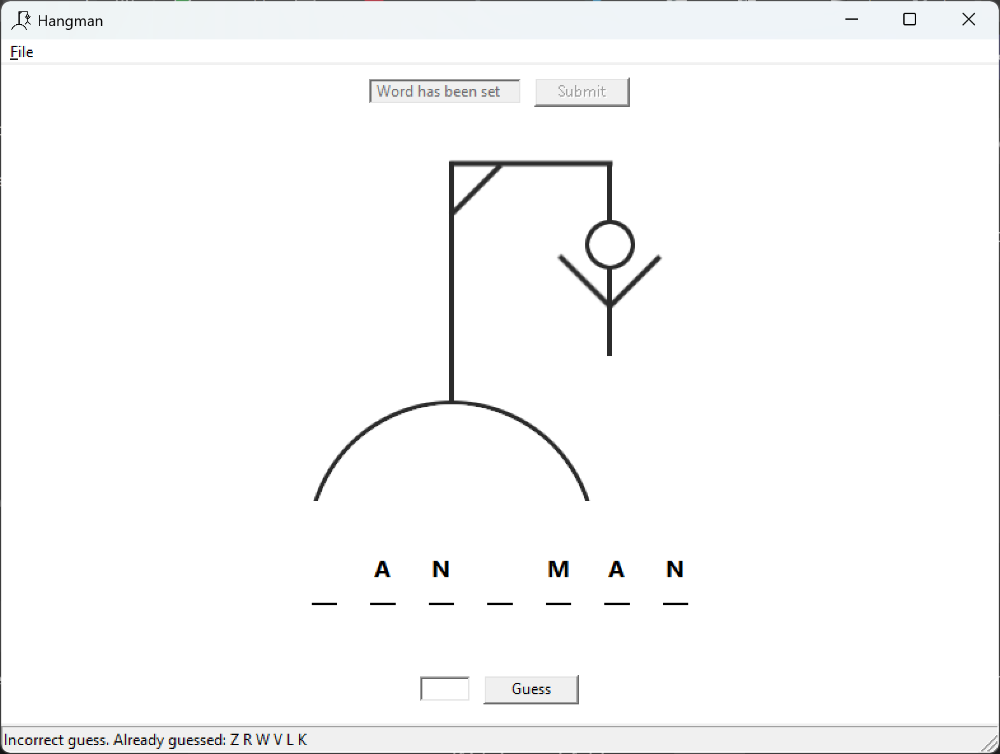

# hangman_cpp

This repository contains a small Hangman project in C++. It is shown in the screenshot below.



This branch adds a minimal wxWidgets-based GUI skeleton and CMake build files to help you get started with wxWidgets on Windows.

Prerequisites
- CMake >= 3.16
- A C++ compiler (Visual Studio, or MinGW)
- wxWidgets unzipped on disk. The repository expects an environment variable named `wxwidgets` pointing to the wxWidgets root (for example: `C:\Desktop\wxWidgets`).

Quick build (PowerShell)

1. Make sure the environment variable `wxwidgets` points to your wxWidgets root. Example:

```powershell
$Env:wxwidgets = 'C:\\Desktop\\wxWidgets'
```

2. Create a build directory and configure with CMake. Example for Visual Studio generator:

```powershell
mkdir build; cd build
cmake -G "Visual Studio 17 2022" -A x64 ..
```

Or for MinGW (if you have a MinGW toolchain in PATH):

```powershell
mkdir build; cd build
cmake -G "MinGW Makefiles" ..
cmake --build . --config Release
```

Notes
- The CMake file will try to pick up the `wxwidgets` environment variable and provide it to CMake's wxWidgets finder. If CMake still can't find wxWidgets, ensure the folder structure is the standard wxWidgets layout (contains `include` and the built libraries), or pass the right variable to CMake.
- On Windows, you typically must build wxWidgets first (unless you downloaded prebuilt binaries). If you only have headers/libraries for a specific Visual Studio version/architecture, match the CMake generator and architecture accordingly.
